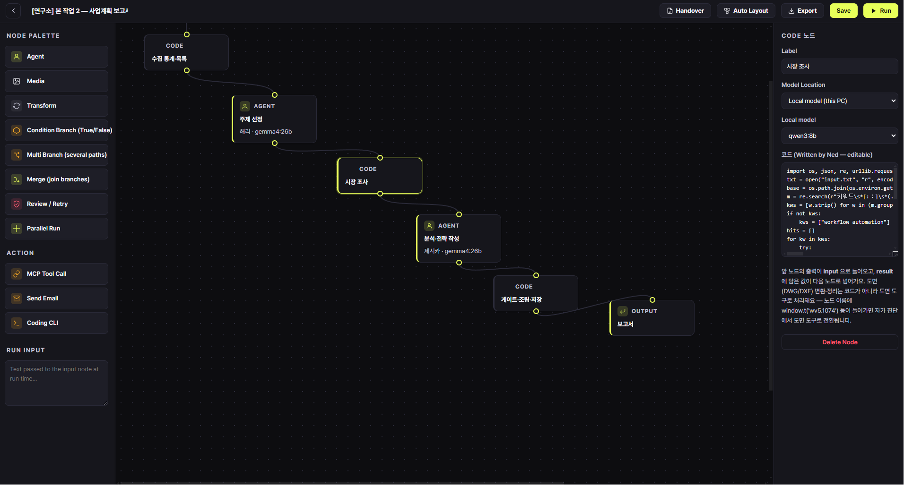
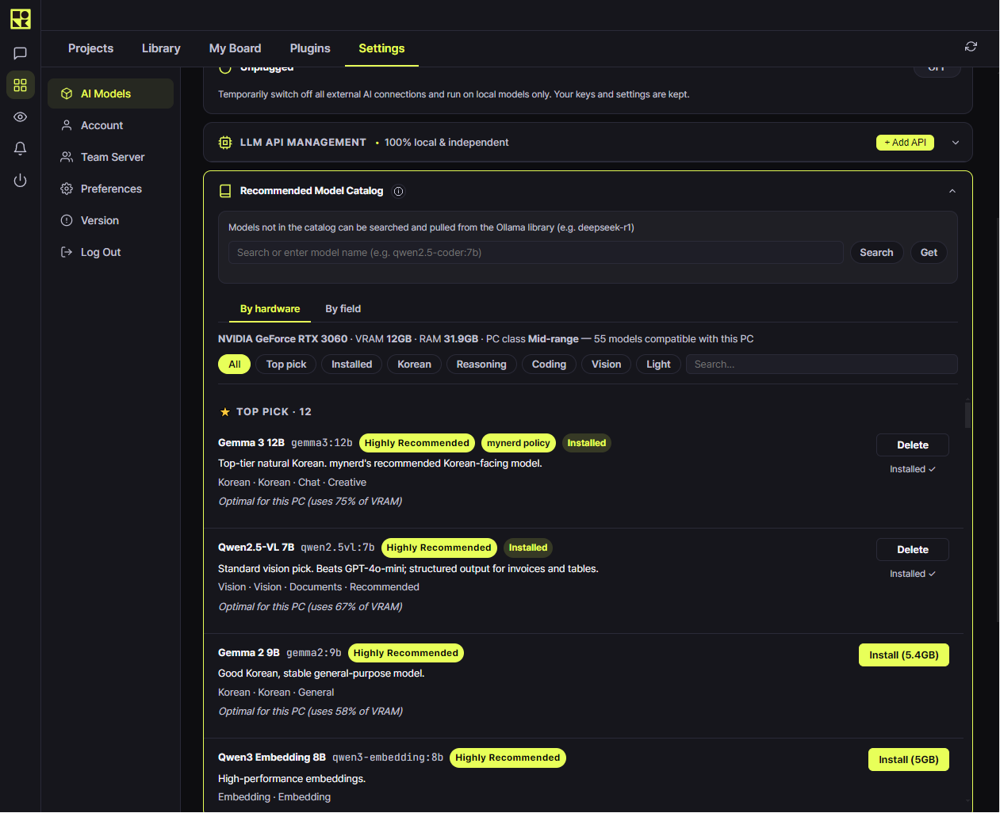
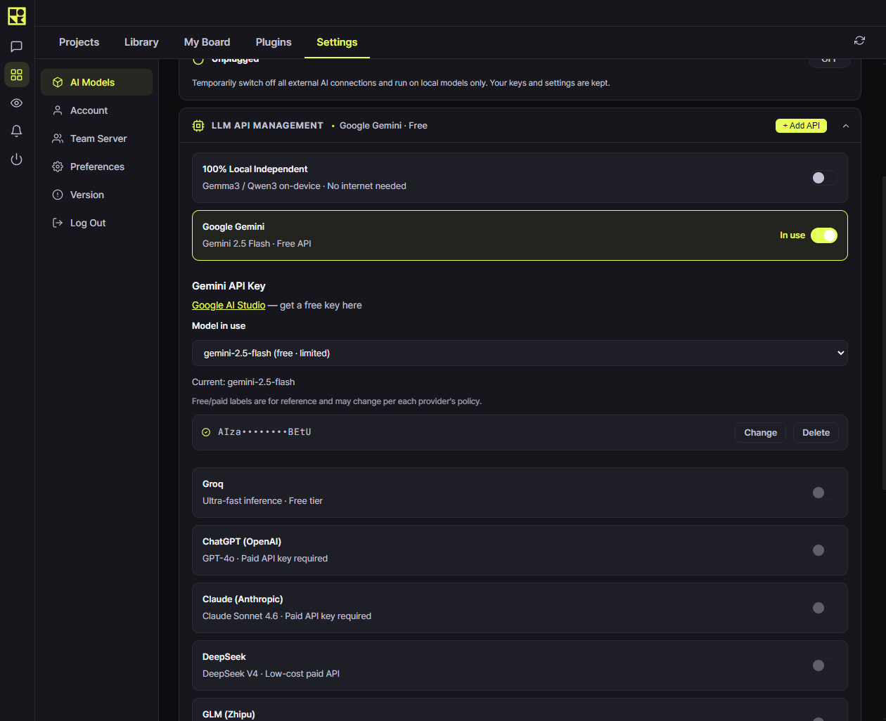

# MYNERD

**Your AI workshop, on your desk.** MYNERD is a desktop app that lets non-developers build and run AI workflows — locally with [Ollama](https://ollama.com), or with external APIs when you want more power. You decide where your data goes.

**[Download for Windows](https://mynerd.io)** · macOS coming soon

---

## What it does

- **Visual workflow builder** — chain steps (collect, write, review, publish) into a pipeline that runs on schedule or on demand. No code required; code allowed.
- **Local-first** — runs models on your own machine via Ollama. Nothing leaves your PC unless you connect an external API on purpose.
- **Hybrid by choice** — plug in external LLM APIs per node when local isn't enough.
- **Ned, the assistant** — talks you through building workflows, watches your runs, reports to Telegram.
- **Live dashboard** — widgets for run monitoring, parallel run comparison, a built-in terminal, and your own custom widgets.
- **Made for professionals, not programmers** — the first users design landscapes and buildings with it. The frame is domain-neutral; you bring the know-how.

## Why local?

Some work shouldn't ride on someone else's server: client documents, unreleased designs, internal numbers. MYNERD's default is your GPU, your disk, your rules — with a clean escape hatch to cloud APIs when a job needs a bigger brain.

MYNERD reads your hardware and tells you which models actually fit it, so you don't have to guess.

And when a job needs a bigger brain, external APIs are one toggle away — or switch them all off and go fully offline.

## Status

Actively developed, shipping every week (see [release notes](https://mynerd.io)). Windows build is live with a free trial. 16 languages.

## Feedback & bugs

Open an [issue](../../issues) — we read everything. Building in public on [Threads @mynerd.official](https://www.threads.net/@mynerd.official).

## License

MYNERD is proprietary software with a free trial. This repository hosts documentation, release notes, and the issue tracker — not the source code.
